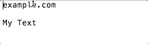

# Alfred-Markdown

[Alfred](https://www.alfredapp.com/) keyboard shortcuts to markdown selected text.

## Install

* download Alfred Markdown.alfredworkflow
* double click & follow prompts to install

## Markdown

### Links

1. Copy link, have it in clipboard
2. Select text
3. `⌘⌃k`

## More to come!

Under development.
